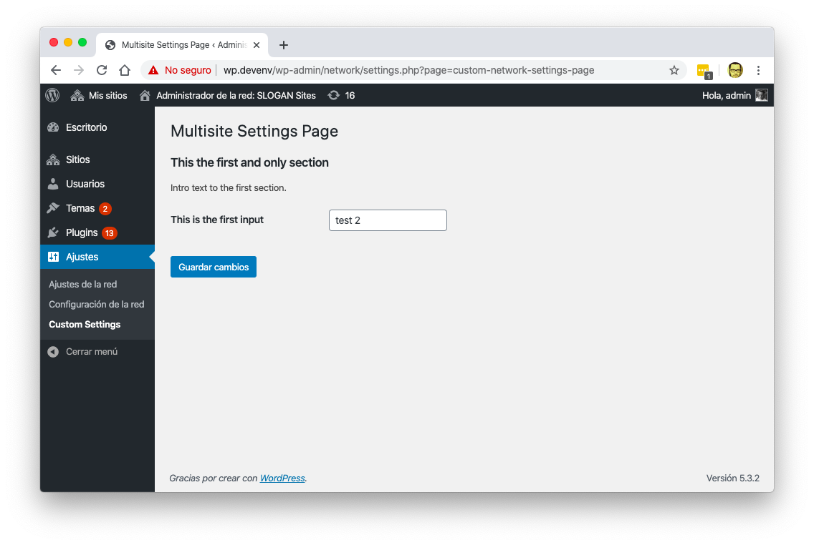

# WordPress Multisite Settings Plugin

This is a fully functional plugin that does just two things:

- Creates a Multisite Settings page in `Network Admin > Settings > Custom Settings`
- Saves a "site" option, which is an option that works only in a multisite environment



## Development

You need to have [composer](https://getcomposer.com) installed globally and a working WordPress installation.

```bash
cd /path/to/wordpress/wp-content/plugins
clone https://github.com/marioy47/wordpress-multisite-settings.git
cd wordpress-multisite-settings
composer install
composer phpcs
```

